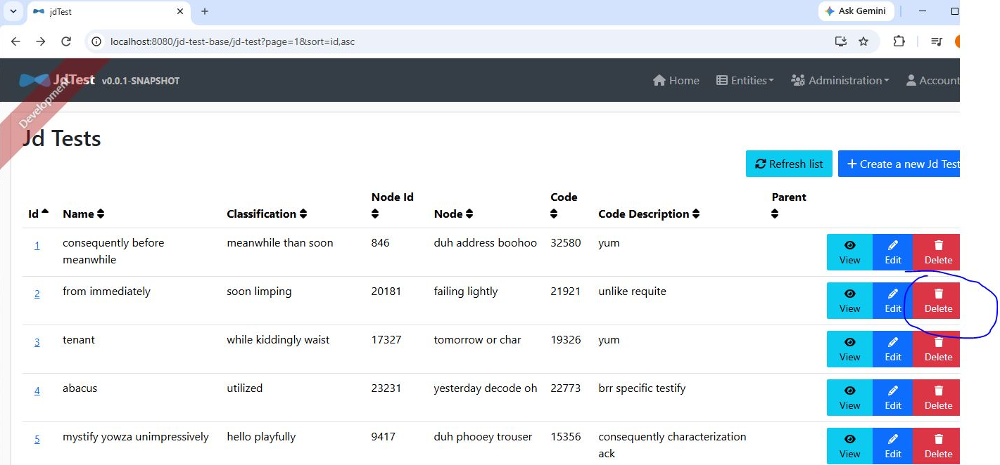

The JHipster generated README.md was moved to README.jhipster.md.

This project is for demonstrating the bug and bug fix for the code generated with generator-jhipster v8.11.0 - may be an old bug.

The bug: it incorrectly used window.location.href. And it crashed (getting a blank screen) after the base-href(e.g., "jd-test-base") was added in the webpack.common.js file - should use React Router instead.

The bug fix can be found on this the commit:

https://github.com/jh64/jd-test/commit/291cc8efdd7e953380852d7e2ef64b7f78efd78b
